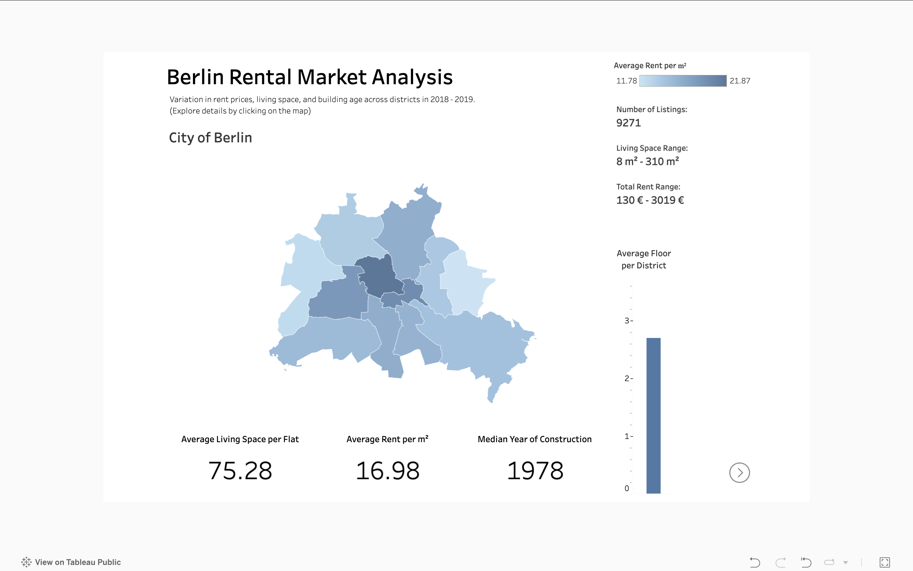
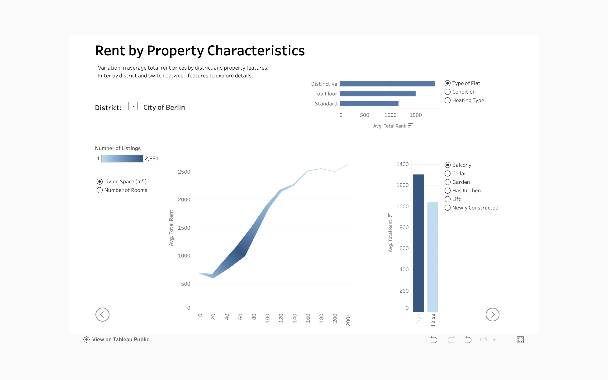
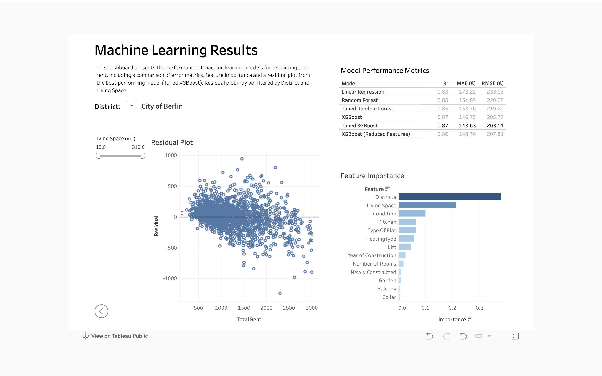

# Berlin Rental Market Analysis

This project explores the rental property market in Berlin using historical listing data from 2018–2019, originally published on Kaggle by user *CorrieBar*. The data comes from ImmoScout24, Germany’s largest real estate platform, and is used here for non-commercial research purposes only.

The goal of the project is to understand how various apartment features influence rent prices across Berlin and to present the insights in an accessible, visual, and predictive format.

---

## Project Structure

### Part 1 – Data Exploration and Analysis
In this notebook, the dataset is cleaned, reshaped, and explored in depth. Both numerical and categorical variables are analyzed in relation to total rent prices.
- Notebook: [`Berlin_Rentals_EDA.ipynb`](Berlin_Rentals_EDA.ipynb)

### Part 2 – Predictive Modeling
This section applies supervised machine learning to predict rent prices. A simple Linear Regression model is used as a baseline, followed by Random Forest and XGBoost for more complex pattern detection.
- Notebook: [`Berlin_Rentals_ML.ipynb`](Berlin_Rentals_ML.ipynb)

### Part 3 – Tableau Dashboard
The most important findings from the EDA and ML stages are presented visually in an interactive dashboard on Tableau Public.

🔗 [View Dashboard on Tableau Public](https://public.tableau.com/views/BerlinRenatalsProject/MapandKPI?:language=en-US&:sid=&:redirect=auth&:display_count=n&:origin=viz_share_link)

---

## Data Source

- [Kaggle Dataset: Apartment Rental Offers in Germany](https://www.kaggle.com/datasets/corrieaar/apartment-rental-offers-in-germany)
- The data originates from [www.immobilienscout24.de](https://www.immobilienscout24.de) and is used strictly for educational and research purposes.
- No explicit license was provided; the data is not used commercially and all rights remain with the original owners.

---

## Tools & Technologies

- **Python**, **Pandas**, **Seaborn**, **Scikit-learn**, **XGBoost**
- **Tableau Public**
- Jupyter Notebooks

---

## Author

**Aleksej Talstou**  
Data Analyst / Aspiring Data Scientist  
Email: talstou@gmail.com 
[LinkedIn Profile](https://www.linkedin.com/in/aliaxey-talstou/)

---

